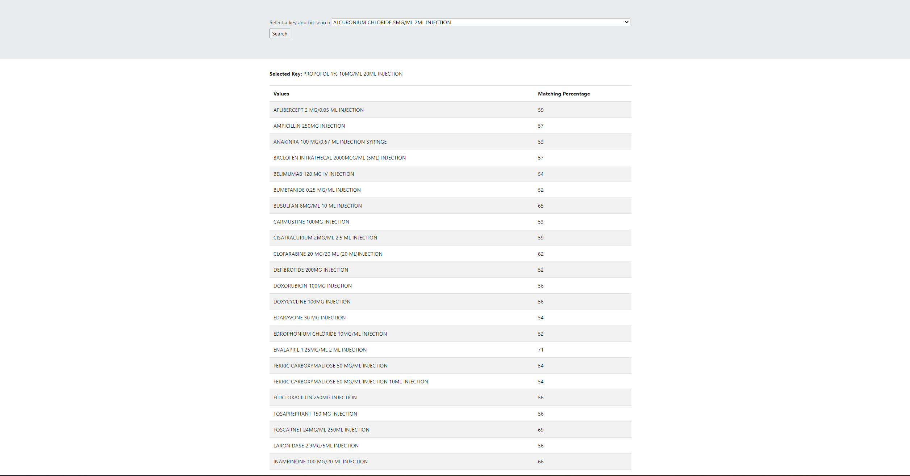

## **Text matching**
- Technologies: Python, Django
- Matching based on levenshtein distance https://en.wikipedia.org/wiki/Levenshtein_distance
- Throttling applied 5/m
- 
## Setup
1) Install docker desktop https://www.docker.com/products/docker-desktop/
2) Build the docker containers by running `docker-compose build`
3) Import the data by running `docker-compose exec web python manage.py import_data`
4) Run the container by running `docker-compose up`

## Pre-commit
1) create a python3 virtual-env
2) Run pip install pre-commit
3) Now it will execute while you commit the code.
